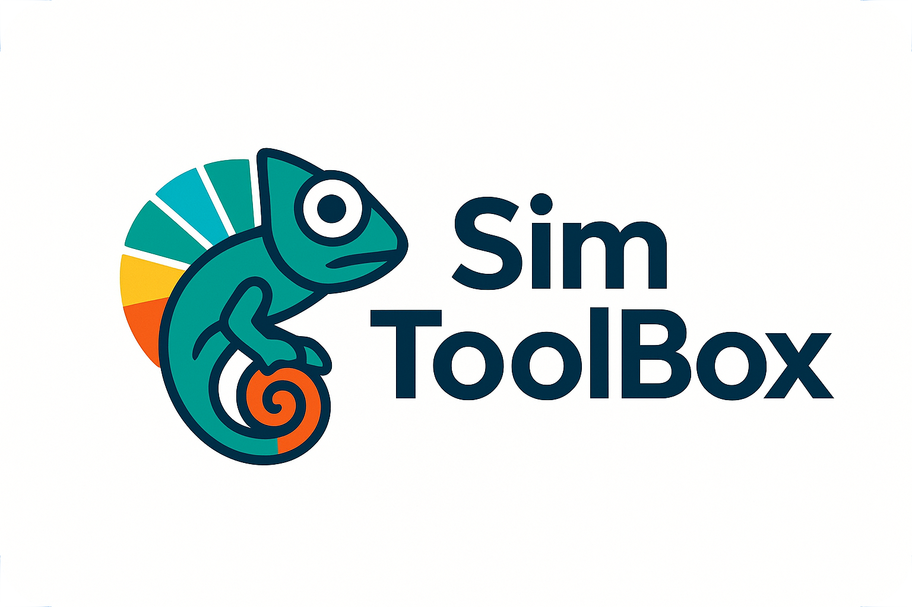

<p align="center">
  
</p>

# SimToolBox

A collection of interconnected financial simulation tools for learning, testing, and demonstrating modern payment and banking infrastructure.

## Live Demo

Experience the full ecosystem in action:

| Service | URL | Description |
|---------|-----|-------------|
| **Banking App** | [banksim.ca](https://banksim.ca) | Create accounts, manage cards, transfer funds |
| **Store** | [ssim.banksim.ca](https://ssim.banksim.ca) | Shop and checkout with card or wallet payments |
| **Wallet** | [wsim.banksim.ca](https://wsim.banksim.ca) | Enroll cards and pay like Apple Pay |
| **Mobile Wallet** | iOS/Android App | Biometric payment approval from your phone |
| **Payment Terminal** | ESP32 Hardware | Point-of-sale terminal with QR code display |
| **Admin** | [admin.banksim.ca](https://admin.banksim.ca) | Manage users, accounts, and settings |

## Architecture

```
┌─────────────┐     ┌─────────────┐     ┌─────────────┐     ┌─────────────┐
│    BSIM     │     │    NSIM     │     │    SSIM     │     │ ssimTerminal│
│   Banking   │◄───►│   Network   │◄───►│    Store    │◄───►│   Payment   │
│  Simulator  │     │  Simulator  │     │  Simulator  │     │  Terminal   │
└─────────────┘     └─────────────┘     └─────────────┘     └─────────────┘
       ▲                   ▲                   ▲
       │                   │                   │
       └───────────┬───────┴───────────────────┘
                   │
            ┌─────────────┐
            │    WSIM     │
            │   Wallet    │
            │  Simulator  │
            └──────┬──────┘
                   │
            ┌──────┴──────┐
            │    MWSIM    │
            │   Mobile    │
            │   Wallet    │
            └─────────────┘
```

---

## BSIM - Banking Simulator

**Repository:** [github.com/jordancrombie/bsim](https://github.com/jordancrombie/bsim)

A full-stack banking application demonstrating modern fintech implementation.

### Authentication & Security
- Passwordless authentication with WebAuthn/Passkeys (Face ID, Touch ID, Windows Hello)
- JWT token-based session management
- Passkey CRUD operations with challenge management

### Account Management
- Account creation and multi-account support
- Deposit, withdrawal, and transfer operations
- Transaction tracking and history
- Balance validation and error handling

### Credit Card System
- Credit card issuance with customizable limits
- Card types: Visa, Mastercard, AMEX
- Charges, payments, and refunds
- Merchant details and MCC code support

### Open Banking Platform
- OAuth 2.0/OIDC provider for third-party access (FDX-inspired)
- OIDC auto-discovery endpoint
- Scope-based consent management
- Account filtering by user consent

### Payment Integration
- Card payment processing via NSIM middleware
- Digital wallet support for WSIM enrollment
- Webhook system with retry logic and exponential backoff
- Ephemeral JWT payment tokens (5-minute TTL)

### Admin Interface
- User management dashboard
- View user accounts, cards, and passkeys
- Configurable branding (custom logo and site name)
- OAuth client administration

---

## NSIM - Network Simulator

**Repository:** [github.com/jordancrombie/nsim](https://github.com/jordancrombie/nsim)

Payment network middleware that routes transactions between merchants and banks—like Visa/Mastercard.

### Payment Operations
- Authorization with automatic 7-day expiry
- Full and partial capture
- Void operations
- Full and partial refunds
- Real-time transaction status

### Transaction States
- State machine: `pending → authorized → captured → refunded`
- Support for: declined, failed, voided, expired
- Complete audit trail

### Webhook System
- Real-time merchant notifications
- Events: `payment.authorized`, `payment.captured`, `payment.voided`, `payment.refunded`, `payment.declined`, `payment.expired`, `payment.failed`
- Configurable retry with exponential backoff
- HMAC-SHA256 signature verification

### Wallet Integration
- WSIM payment token support
- Multiple token formats (ctok_, wsim_bsim_, JWT)
- Token analysis and validation diagnostics

### API Endpoints
- `POST /api/v1/payments/authorize` - Authorize payment
- `POST /api/v1/payments/:id/capture` - Capture payment
- `POST /api/v1/payments/:id/void` - Void authorization
- `POST /api/v1/payments/:id/refund` - Refund payment
- `GET /api/v1/payments/:id` - Get transaction status
- Webhook CRUD endpoints for merchant registration

---

## SSIM - Store Simulator

**Repository:** [github.com/jordancrombie/ssim](https://github.com/jordancrombie/ssim)

E-commerce store demonstrating complete payment workflows.

### Shopping Experience
- Product catalog with shopping cart
- Add-to-cart and quantity management
- Order history and details
- Order confirmation pages

### Payment Features
- Full payment lifecycle: authorize, capture, void, refund
- Bank card payments via NSIM
- Digital wallet payments via WSIM
- Real-time status updates via webhooks
- Decline handling with retry capability

### Authentication
- OIDC login via BSIM identity provider
- PKCE (Proof Key for Code Exchange) security
- RP-Initiated Logout (ends sessions at both SSIM and BSIM)
- OAuth 2.0 Resource Indicators (RFC 8707)

### Admin Dashboard
- Product management (add, edit, delete, toggle availability)
- Order management with full visibility
- Payment operations (capture, void, refund)
- Email-based access control

### Open Banking Integration
- KENOK integration for account data retrieval
- Dedicated account access page
- Secure token handling

---

## WSIM - Wallet Simulator

**Repository:** [github.com/jordancrombie/wsim](https://github.com/jordancrombie/wsim)

Digital wallet aggregator—like Apple Pay or Google Pay for the simulation ecosystem.

### Core Wallet Features
- Enroll cards from multiple banking simulators
- Single sign-on to access all enrolled credentials
- Pay at stores without re-authenticating to each bank
- Unified credential vault

### Enrollment Management
- List available banks for enrollment
- OAuth-based enrollment flow with `wallet:enroll` scope
- View enrolled banks and associated cards
- Remove enrollments and individual cards

### Payment Operations
- Card listing by enrolled user
- Payment authorization via `payment:authorize` scope
- Ephemeral token generation for transactions
- Multi-simulator routing (WSIM → BSIM → NSIM)

### Admin Interface
- Passkey-only authentication (WebAuthn/FIDO2)
- OAuth client management for store simulators
- Role-based access control (ADMIN, SUPER_ADMIN)
- Administrator invitation system

---

## MWSIM - Mobile Wallet Simulator

**Repository:** [github.com/jordancrombie/mwsim](https://github.com/jordancrombie/mwsim)

A React Native mobile wallet app (iOS/Android) that extends WSIM with native mobile capabilities.

### Authentication & Security
- Device-based authentication with unique device binding
- Email verification and password login
- Biometric setup (Face ID, Touch ID) for payment authorization
- JWT tokens with secure storage (Keychain/Keystore)
- Automatic token refresh with rotation

### Bank Enrollment
- Browse and enroll cards from multiple banking simulators
- OAuth 2.0 enrollment via system browser (Safari/Chrome)
- Deep link callback handling (`mwsim://enrollment/callback`)
- Automatic card import after successful enrollment

### Wallet Management
- View all enrolled cards with card type and bank info
- Set default payment card
- Remove cards from wallet
- Pull-to-refresh synchronization
- Offline support with cached card data

### Mobile Payment Flow
- Deep link payment requests from merchants (`mwsim://payment/:requestId`)
- Payment approval screen with merchant details and amount
- Biometric confirmation required for all payments
- Browser-aware return (opens original browser: Safari, Chrome, Firefox, Edge)
- Seamless checkout completion back at merchant

### Developer Tools
- Environment switching (Dev/Production) via iOS Settings
- Visual environment indicator badge
- Device reset for testing
- Debug logging for API calls

---

## ssimTerminal - Payment Terminal

**Repository:** [github.com/jordancrombie/ssimTerminal](https://github.com/jordancrombie/ssimTerminal)

ESP32 firmware for a dedicated point-of-sale payment terminal that integrates with SSIM.

### Hardware Platform
- Waveshare ESP32-S3-Touch-AMOLED-1.8
- Dual-core ESP32-S3R8 at 240MHz
- 1.8" AMOLED touchscreen (368x448 pixels)
- WiFi 2.4GHz and Bluetooth 5.0
- 16MB flash, 8MB PSRAM

### Core Functionality
- WebSocket connection to SSIM server
- QR code display for customer payments
- Real-time transaction status updates
- Touch-enabled user interface
- Automatic reconnection and heartbeat

### Terminal States
- **BOOT** → Initial hardware setup
- **WIFI_SETUP** → Network configuration via touch UI
- **PAIRING** → First-run server authentication
- **CONNECTING** → WebSocket establishment
- **IDLE** → Ready for payment requests
- **QR_DISPLAY** → Showing payment QR code
- **RESULT** → Transaction outcome display

### Communication Protocol
- Secure WebSocket (`wss://`) with API key authentication
- Server pushes payment requests to registered terminals
- Terminal sends heartbeat telemetry and status updates
- HMAC-signed message acknowledgments

### Development Stack
- PlatformIO with Arduino framework
- LVGL 8.3.x for graphics
- Arduino_GFX for display driver
- QRCode library for code generation
- ArduinoJson v7 for protocol handling

---

## How They Work Together

### Web Checkout Flow
1. **User creates an account at BSIM** → Gets bank accounts and credit cards
2. **User enrolls cards in WSIM** → Cards aggregated in digital wallet
3. **User shops at SSIM** → Browses products, adds to cart
4. **User checks out** → Chooses bank card or wallet payment
5. **SSIM sends authorization to NSIM** → Network routes to BSIM
6. **BSIM validates and authorizes** → Response flows back through NSIM
7. **SSIM captures payment** → Order complete, webhooks fire

### Mobile Wallet Flow
1. **User installs MWSIM app** → Creates account or logs in
2. **User enrolls cards via OAuth** → System browser opens BSIM for card selection
3. **Cards sync to mobile wallet** → Ready for payments
4. **User shops at SSIM on mobile** → Chooses "Pay with Mobile Wallet"
5. **Deep link opens MWSIM** → Payment details displayed with card selector
6. **User approves with biometrics** → Face ID or Touch ID confirms payment
7. **Browser-aware return** → User returns to original browser with order confirmed

### Point of Sale Flow
1. **Merchant sets up ssimTerminal** → Connects to WiFi and pairs with SSIM
2. **Customer ready to pay** → Merchant initiates payment on SSIM
3. **Terminal displays QR code** → Payment amount and QR shown on AMOLED screen
4. **Customer scans with MWSIM** → Opens payment approval in mobile wallet
5. **Customer approves with biometrics** → Face ID or Touch ID confirms
6. **Terminal shows result** → Success/failure displayed in real-time
7. **Ready for next transaction** → Terminal returns to idle state

---

## Use Cases

- **Learning**: Understand how modern payment systems interconnect
- **Testing**: Develop and test payment integrations in a safe sandbox
- **Demonstration**: Showcase OAuth flows, WebAuthn, and payment processing
- **Prototyping**: Build new financial applications against realistic APIs
- **Education**: Teach fintech concepts with working examples

---

## Tech Stack

All projects share a common technical foundation:

| Layer | Technology |
|-------|------------|
| **Backend** | Node.js, Express, TypeScript |
| **Web Frontend** | Next.js, React, Tailwind CSS |
| **Mobile** | React Native, Expo SDK 54, TypeScript |
| **Embedded** | ESP32-S3, PlatformIO, Arduino, LVGL |
| **Database** | PostgreSQL with Prisma ORM |
| **Auth** | OAuth 2.0/OIDC, WebAuthn/Passkeys, JWT, Biometrics |
| **Infrastructure** | Docker, Docker Compose, nginx |
| **Cloud** | AWS ECS Fargate, ElastiCache Redis, S3 |
| **Testing** | Jest (462+ unit tests), Playwright (76+ E2E tests) |

---

## Getting Started

Each project has detailed setup instructions. Recommended order:

1. **[BSIM](https://github.com/jordancrombie/bsim)** - Set up banking first (provides authentication)
2. **[NSIM](https://github.com/jordancrombie/nsim)** - Deploy the payment network
3. **[SSIM](https://github.com/jordancrombie/ssim)** - Launch the store
4. **[WSIM](https://github.com/jordancrombie/wsim)** - Add wallet capabilities
5. **[MWSIM](https://github.com/jordancrombie/mwsim)** - Mobile wallet app (iOS/Android)
6. **[ssimTerminal](https://github.com/jordancrombie/ssimTerminal)** - Hardware payment terminal (ESP32)

Or just explore the [live demo](https://banksim.ca) to see everything in action.

---

## License

See individual project repositories for license information.
